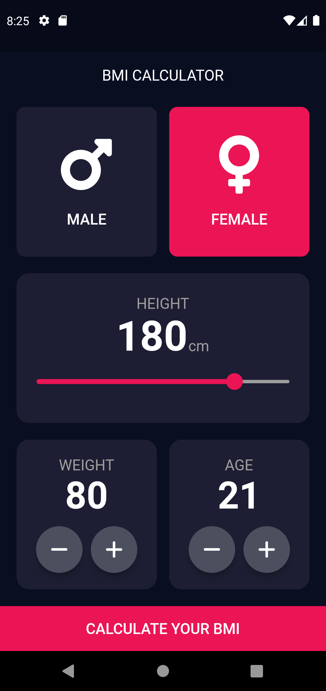
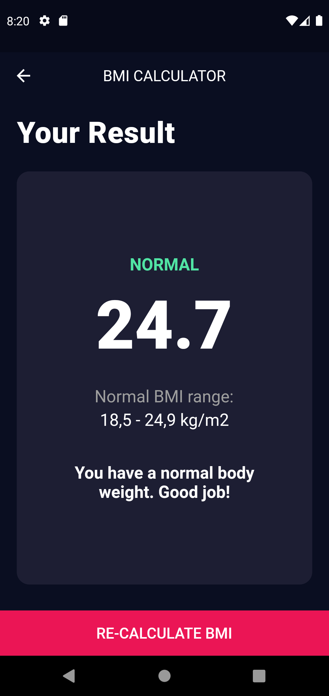

# Flutter BMI Calculator

A beautiful BMI calculator app. Developed using Flutter.

### Library Used

- Material
- Dart Math
- FontAwesome

### Widgets / Classes Used

- StatefulWidget
- Scaffold
- AppBar
- Text
- TextStyle
- SafeArea
- Padding
- Column
- Row
- Colors
- Color
- Expanded
- FlatButton
- Center
- Icon
- Alert
- AlertStyle
- DialogButton

### Concepts Used

- Object Oriented Programming
- Class
- Property
- Constructor
- Method
- Abstraction
- Inheritance
- Encapsulation
- Polymorphism
- List
- Conditional

## Preview

 

